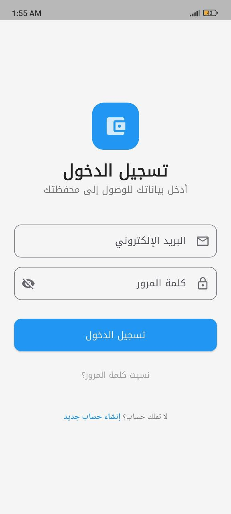
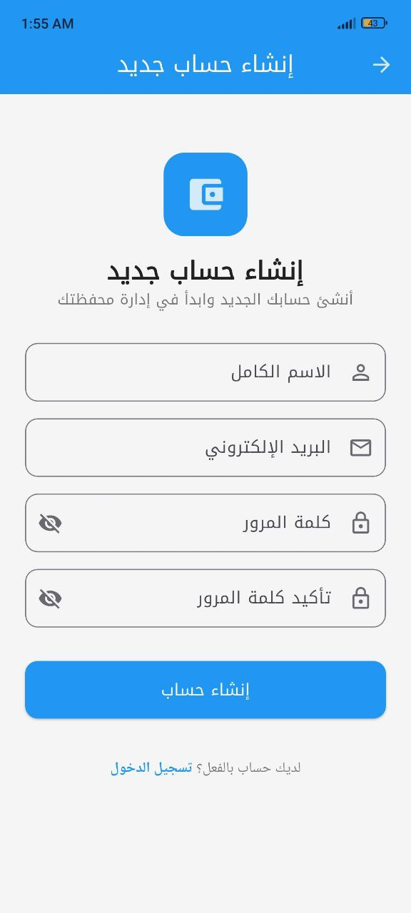
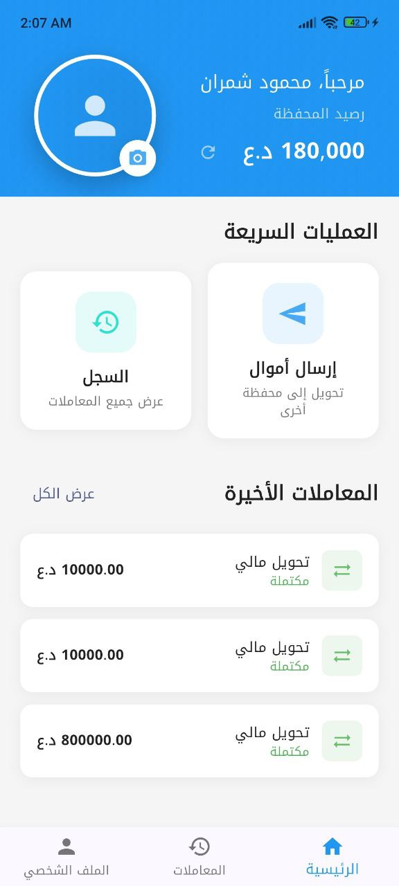
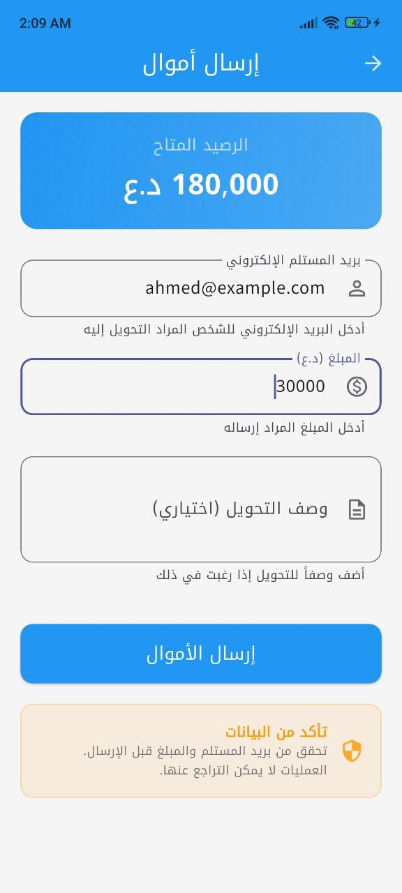
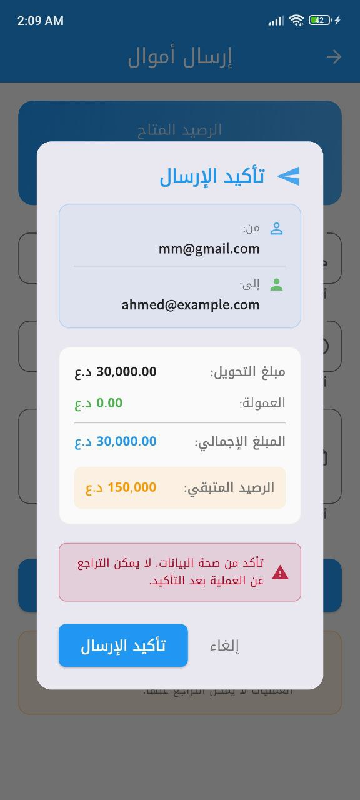
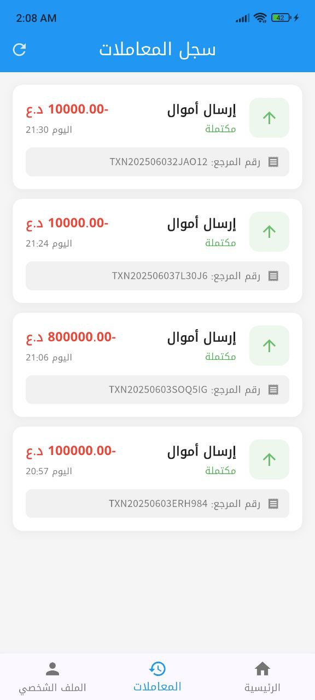
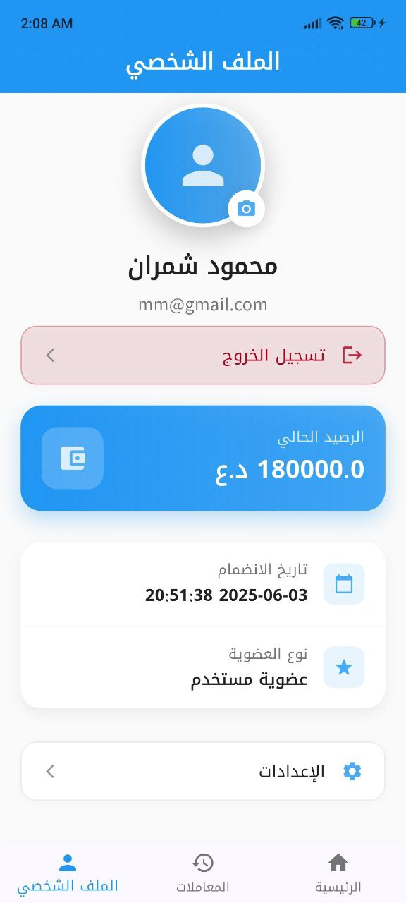
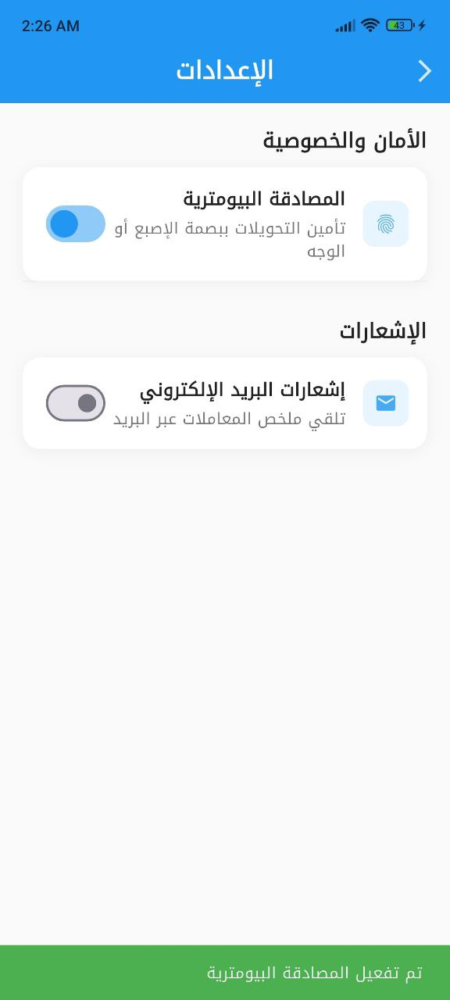

# Mobile Financial System 💰

A full-stack mobile financial application built with Laravel (Backend) and Flutter (Frontend) that enables secure money transfers between users.

## 📋 Table of Contents

- [Features](#features)
- [Tech Stack](#tech-stack)
- [Project Structure](#project-structure)
- [Prerequisites](#prerequisites)
- [Installation & Setup](#installation--setup)
  - [Backend (Laravel)](#backend-laravel)
  - [Frontend (Flutter)](#frontend-flutter)
- [API Documentation](#api-documentation)
- [Testing](#testing)
- [Deployment](#deployment)
- [Screenshots](#screenshots)
- [Demo](#demo)
- [Contributing](#contributing)
- [License](#license)

## ✨ Features

### Backend (Laravel)
- 🔐 JWT/Sanctum Authentication
- 💸 Secure Money Transfer API
- 📊 Transaction History
- 💰 Wallet Balance Management
- 📧 Email Notifications (Events)
- 🛡️ Rate Limiting
- 🔒 Data Validation & Security

### Frontend (Flutter)
- 📱 Cross-platform Mobile App
- 🔑 Secure User Authentication
- 💳 Wallet Balance Display
- 💸 Send Money Interface
- 📱 Real-time Balance Updates
- ⚡ State Management (Provider/Bloc)
- 🎨 Material Design UI
- 🔐 Secure Token Storage

## 🛠️ Tech Stack

### Backend
- **Framework:** Laravel 9+
- **Authentication:** JWT/Sanctum
- **Database:** MySQL/PostgreSQL
- **Queue:** Redis (for email notifications)
- **Cache:** Redis
- **API:** RESTful API

### Frontend
- **Framework:** Flutter 3+
- **HTTP Client:** http package
- **State Management:** Provider/Bloc
- **Storage:** SharedPreferences
- **UI:** Material Design

## 📁 Project Structure

```
mobile-financial-system/
├── backend/                 # Laravel Backend
│   ├── app/
│   │   ├── Http/Controllers/
│   │   ├── Models/
│   │   ├── Events/
│   │   └── Listeners/
│   ├── database/
│   │   ├── migrations/
│   │   └── seeders/
│   ├── routes/
│   └── tests/
├── frontend/               # Flutter Frontend
│   ├── lib/
│   │   ├── models/
│   │   ├── services/
│   │   ├── screens/
│   │   ├── widgets/
│   │   └── providers/
│   ├── assets/
│   └── test/
└── README.md
```

## 📋 Prerequisites

### Backend Requirements
- PHP 8.1+
- Composer
- MySQL 8.0+ or PostgreSQL
- Redis (optional, for queues)

### Frontend Requirements
- Flutter SDK 3.0+
- Dart SDK
- Android Studio/VS Code
- Android SDK (for Android development)
- Xcode (for iOS development, macOS only)

## 🚀 Installation & Setup

### Backend (Laravel)

1. **Clone the repository**
   ```bash
   git clone https://github.com/your-username/mobile-financial-system.git
   cd mobile-financial-system/backend
   ```

2. **Install dependencies**
   ```bash
   composer install
   ```

3. **Environment setup**
   ```bash
   cp .env.example .env
   php artisan key:generate
   ```

4. **Configure database in `.env`**
   ```env
   DB_CONNECTION=mysql
   DB_HOST=127.0.0.1
   DB_PORT=3306
   DB_DATABASE=financial_system
   DB_USERNAME=your_username
   DB_PASSWORD=your_password
   
   JWT_SECRET=your_jwt_secret_key
   ```

5. **Run migrations and seeders**
   ```bash
   php artisan migrate
   php artisan db:seed
   ```

6. **Start the development server**
   ```bash
   php artisan serve
   ```

### Frontend (Flutter)

1. **Navigate to frontend directory**
   ```bash
   cd ../frontend
   ```

2. **Install dependencies**
   ```bash
   flutter pub get
   ```

3. **Configure API endpoints**
   ```dart
   // lib/config/api_config.dart
   class ApiConfig {
     static const String baseUrl = 'http://your-backend-url/api';
   }
   ```

4. **Run the application**
   ```bash
   flutter run
   ```

## 📚 API Documentation

### Authentication

#### Login
```http
POST /api/login
Content-Type: application/json

{
  "email": "user@example.com",
  "password": "password"
}
```

**Response:**
```json
{
  "success": true,
  "token": "jwt_token_here",
  "user": {
    "id": 1,
    "name": "John Doe",
    "email": "user@example.com",
    "wallet_balance": 1000.00
  }
}
```

#### Register
```http
POST /api/register
Content-Type: application/json

{
  "name": "John Doe",
  "email": "user@example.com",
  "password": "password",
  "password_confirmation": "password"
}
```

### Money Transfer

#### Send Money
```http
POST /api/send-money
Authorization: Bearer {token}
Content-Type: application/json

{
  "recipient_email": "recipient@example.com",
  "amount": 50.00
}
```

**Response:**
```json
{
  "success": true,
  "message": "Money sent successfully",
  "transaction": {
    "id": "TXN123456",
    "amount": 50.00,
    "status": "completed",
    "created_at": "2024-01-15T10:30:00Z"
  },
  "sender_balance": 950.00,
  "recipient_balance": 1050.00
}
```

#### Get Balance
```http
GET /api/wallet/balance
Authorization: Bearer {token}
```

#### Transaction History
```http
GET /api/transactions
Authorization: Bearer {token}
```

## 🧪 Testing

### Backend Testing
```bash
cd backend
php artisan test
```

### Frontend Testing
```bash
cd frontend
flutter test
```

## 🚀 Deployment

### Backend Deployment (Heroku)

1. **Install Heroku CLI**
2. **Login to Heroku**
   ```bash
   heroku login
   ```

3. **Create Heroku app**
   ```bash
   heroku create your-app-name
   ```

4. **Set environment variables**
   ```bash
   heroku config:set APP_KEY=your_app_key
   heroku config:set DB_CONNECTION=pgsql
   # Add other environment variables
   ```

5. **Deploy**
   ```bash
   git push heroku main
   heroku run php artisan migrate
   ```

### Frontend Deployment

#### Build APK
```bash
flutter build apk --release
```

#### Build iOS (macOS only)
```bash
flutter build ios --release
```

## 📱 Screenshots

<div style="display: flex; overflow-x: auto; gap: 10px;">
  
  
  
  
  
  
  
  
  
</div>

## 🎥 Demo

- **APK Download:** [Download Link](https://github.com/pr-mah99/mobile-financial-system/releases)
- **Screen Recording:** [Watch Demo](https://youtu.be/your-demo-video)
<!-- - **Live Backend API:** [API Base URL](https://your-backend-url.herokuapp.com/api) -->

## 🔧 Configuration

### Backend Configuration

#### JWT Configuration
```bash
php artisan jwt:secret
```

#### Queue Configuration
```env
QUEUE_CONNECTION=redis
REDIS_HOST=127.0.0.1
REDIS_PASSWORD=null
REDIS_PORT=6379
```

#### Mail Configuration
```env
MAIL_MAILER=smtp
MAIL_HOST=smtp.gmail.com
MAIL_PORT=587
MAIL_USERNAME=your-email@gmail.com
MAIL_PASSWORD=your-app-password
```

### Frontend Configuration

#### HTTP Configuration
```dart
// lib/services/api_service.dart
class ApiService {
  static const String baseUrl = 'https://your-backend-url.herokuapp.com/api';
  static const Duration timeout = Duration(seconds: 30);
}
```

## 🔒 Security Features

- JWT token-based authentication
- Password encryption using bcrypt
- Input validation and sanitization
- Rate limiting on sensitive endpoints
- CORS protection
- SQL injection prevention
- XSS protection

## 📊 Performance Features

- Database query optimization
- API response caching
- Image optimization
- Lazy loading
- Background queue processing

## 🤝 Contributing

1. Fork the repository
2. Create your feature branch (`git checkout -b feature/AmazingFeature`)
3. Commit your changes (`git commit -m 'Add some AmazingFeature'`)
4. Push to the branch (`git push origin feature/AmazingFeature`)
5. Open a Pull Request

## 📄 License

This project is licensed under the MIT License - see the [LICENSE](LICENSE) file for details.

## 📞 Contact

**Developer:** Mahmoud Shamran Atheeb-
- **Instagram:** [@pr_mah99](https://www.instagram.com/pr_mah99)
- **Telegram:** [@pr_mah99](https://t.me/pr_mah99)
- **GitHub:** [@pr-mah99](https://github.com/pr-mah99)
- **LinkedIn:** [@pr-mah99](https://linkedin.com/in/pr-mah99)
- **Youtube:** [@pr-mah99](https://www.youtube.com/@pr_mah99)

## 🙏 Acknowledgments

- Laravel community for excellent documentation
- Flutter team for the amazing framework
- All contributors who helped make this project better

---

## ⏱️ Development Time

- **Backend Development:** 6-8 hours
- **Frontend Development:** 4-6 hours
- **Testing & Documentation:** 2-3 hours
- **Total Time:** 12-17 hours

## 📝 Notes & Assumptions

- Users start with a default balance of 1000.00
- Transaction fees are not implemented in this version
- Email notifications are simulated (no actual emails sent in test environment)
- Rate limiting is set to 10 requests per minute for send-money endpoint
- All monetary values are stored with 2 decimal precision

---

**Made with ❤️ using Laravel & Flutter**